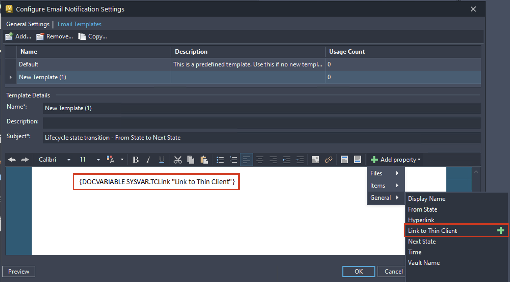

# Administration Enhancements (What's New in 2026)

## Vault Account Enhancement – Security updates

## Thin Client URL Property in email template

## Server Event Low Priority Mode for Property Compliance Check

## Vault administrator contact details

### Was this information helpful?

- Email

- Facebook

- Twitter

- LinkedIn

- Yes

- No

Check out the new capabilities and enhancements available for administration in this release.

As an administrator, you can now set a "Disable On" date for user accounts. The account will be automatically disabled on the specified date based on the server date. A Vault Ideas submission

You can now add or remove the Thin Client URL property in the email template. For more information, see Customize Email Notification Template

The Low Priority Mode will be enabled during working hours by default. This mode now supports property compliance checks. Property compliance checks can be triggered by property definition changes during working hours.

The administrator can add their contact information in the newly introduced "Contact your Vault Administrator" field in vault server. The administrator contact information will be displayed to users, whose user account is disabled and when they try to login to server from Vault Client.

For more information, see Security Global Settings .

## Images

