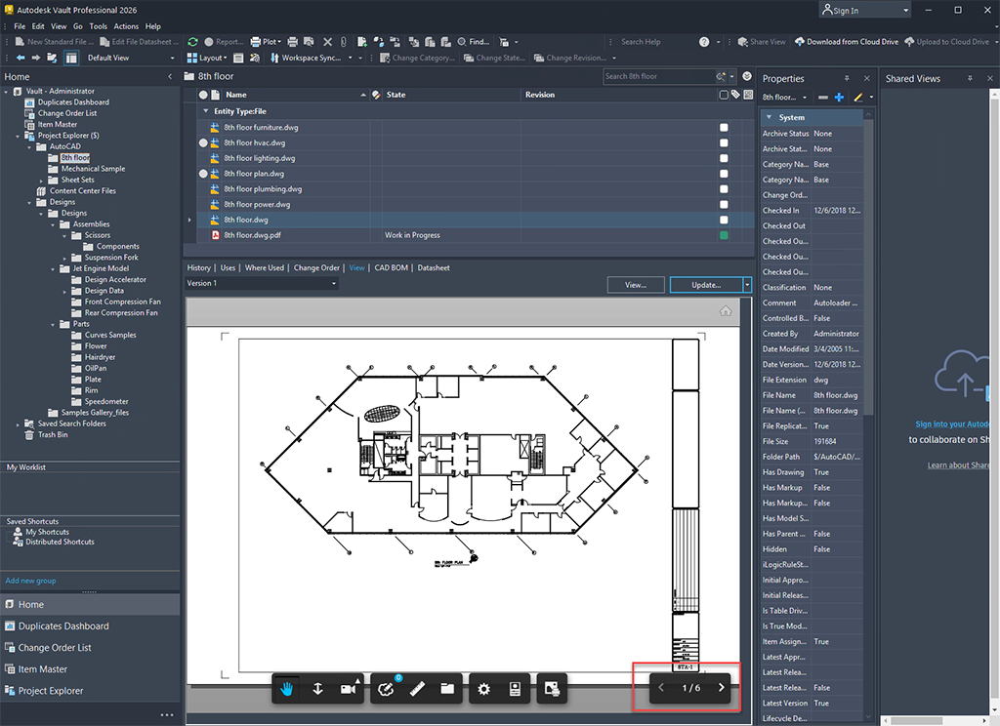
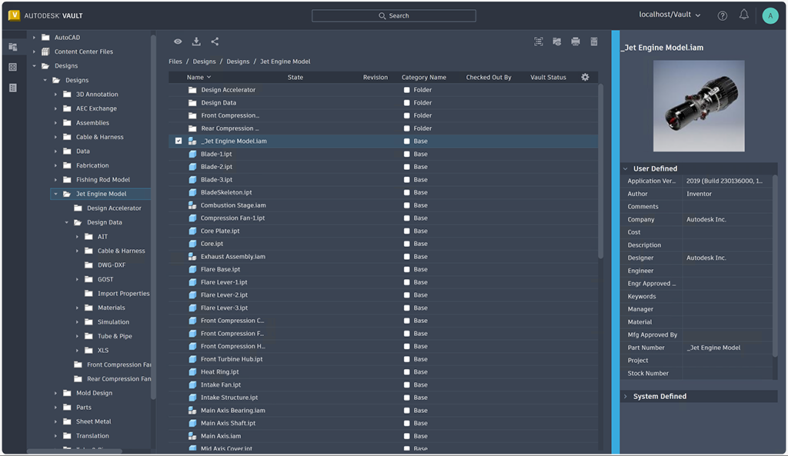

# Collaboration Enhancements (What's New in 2026.1)

# Viewer Document Navigation

# Thin Client Enhancements

### Was this information helpful?

- Email

- Facebook

- Twitter

- LinkedIn

- Yes

- No

Explore the new capabilities and enhancements introduced in this release, which enhance collaboration.

Navigate Multi-Sheet Drawings 30% Faster in the Vault Viewer.

Vault 2026.1 introduces robust new navigation buttons in the integrated viewer for both thick and thin clients, designed to significantly expedite the review process. Users can now traverse multi-sheet drawings in the Autodesk Viewer with ease—eliminating the need for repetitive clicking or the search for the appropriate page. This intuitive enhancement enhances productivity by up to 30%, allowing teams to review documentation more expeditiously and make informed decisions with assurance. Regardless of whether one is involved in engineering, manufacturing, or quality control, improved navigation translates to accelerated progress.

For more information, see Autodesk Viewer Tools

Feature was inspired by suggestions from the Vault Community Idea Board .

Resize, Remember, and Review Faster in the Vault Thin Client

Vault 2026.1 presents a more innovative and efficient approach to managing file properties within the Thin Client environment. The introduction of a resizable property panel, accompanied by persistent panel settings, allows users to instantly view extended property values without the necessity to hover or scroll. This advancement not only conserves time but also mitigates frustration. Furthermore, enhanced caching substantially decreases load times when handling large assemblies, facilitating the revisitation of files without unnecessary waiting periods. The overall experience is quicker and more seamless, allowing users to concentrate on making decisions rather than encountering delays.

For more information, see Thin Client - The Interface

Feature was inspired by suggestions from the Vault Community Idea Board .

## Images

