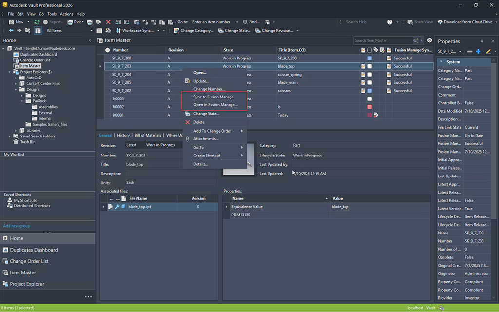

# Connectivity Enhancements (What's New in 2026.1)

# Vault Connector

### Was this information helpful?

- Email

- Facebook

- Twitter

- LinkedIn

- Yes

- No

Connect Vault to Fusion Manage Seamlessly and Efficiently with the new Vault Connector

Vault 2026.1 introduces the Vault Connector, a native, out-of-the-box (OOTB) connector that bridges the gap between design data management and process management systems. The Vault Connector is a powerful new integration that connects Autodesk Vault Professional (PDM) with Fusion Manage (PLM). This solution streamlines enterprise workflows by automating item and BOM synchronization, attaching neutral format files, and mapping attributes between systems. With built-in user notifications, configurable data flows, and support for multiple Vaults within a single Fusion Manage tenant, teams save hours of manual effort and avoid costly errors. From editing Items to creating BOMs, every step is faster, wiser, and fully connected.

For more information about the Vault Connector, see Vault Connector . For frequently asked questions about the Vault Connector, see Vault Connector FAQs .

## Images

