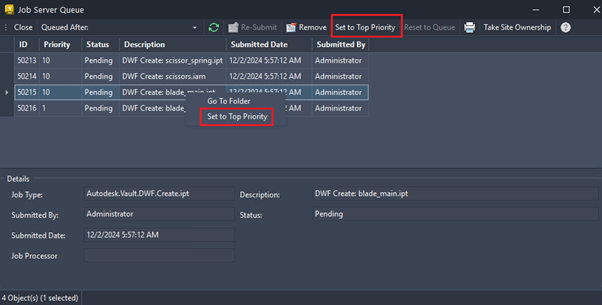

# Job Processor Enhancements (What's New in 2026)

## Push a job to top of the queue

### Was this information helpful?

- Email

- Facebook

- Twitter

- LinkedIn

- Set to Top Priority : Right-click a specific job to access this option and promote it for immediate execution.

- Yes

- No

You can prioritize and control job executions to better manage failures when given the Job Queue Reserve role.

You can now control job execution priorities and handle job failures efficiently. With the ability to promote critical jobs and enable automatic retries, users with Job Queue Reserve role can ensure smoother processing and minimize delays.

For more information, see Job Server Queue Overview .

Feature was inspired by suggestions from the Vault Community Idea Board .

## Images

