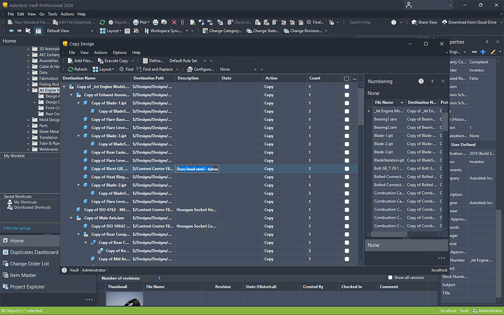
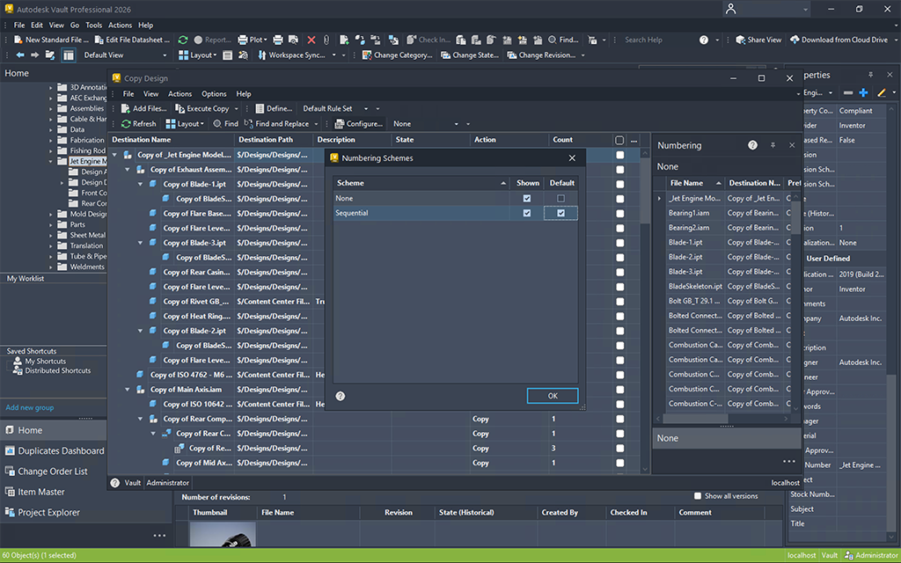
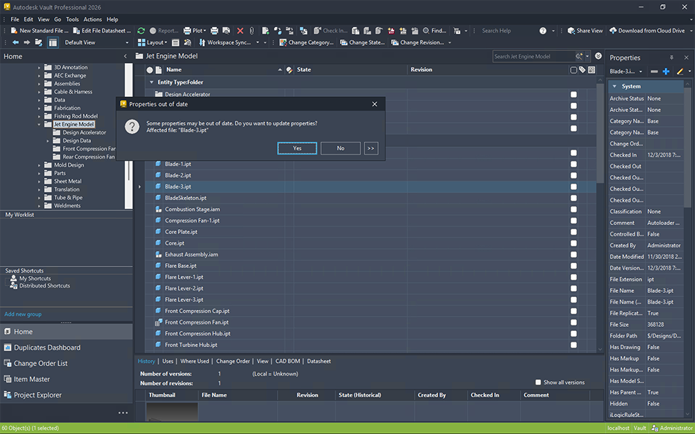
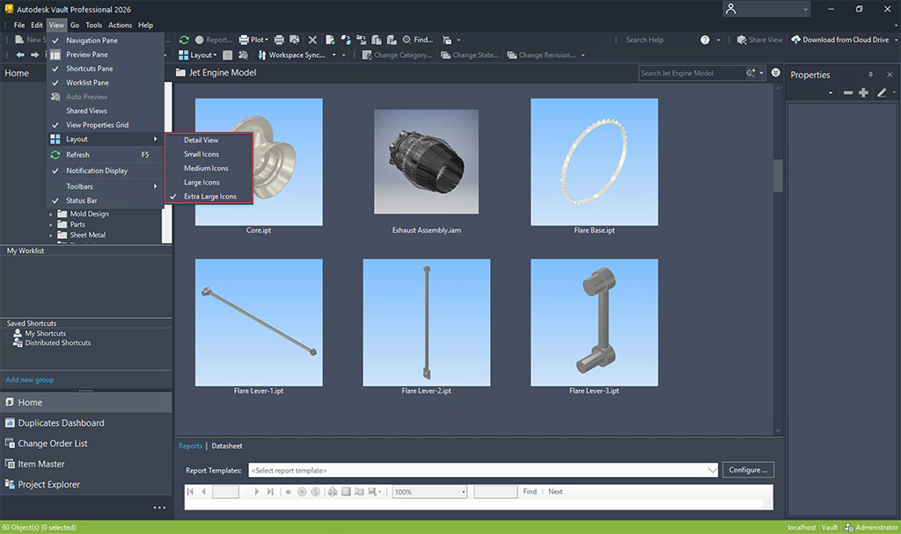

# Workflow Enhancements (What's New in 2026.1)

# Copy Design - Property Editing

# Copy Design – Numbering Scheme

# Update Properties Enhancement

# Batch Plot Enhancement

# Layout View Enhancement

# PDF Automatic Item Attachment

### Was this information helpful?

- Email

- Facebook

- Twitter

- LinkedIn

- Yes

- No

Explore the new capabilities and enhancements introduced in this release, which enhance workflow efficiencies.

Unlock a more intelligent and streamlined design workflow with the Vault 2026.1 Update. This enhanced Copy Design feature now empowers users to edit key properties during the copying process, thereby eliminating the risk of missed updates and conserving valuable time. Whether one is duplicating a drawing, a complete design structure, or individual components, it is now possible to modify multiple properties simultaneously, utilizing intuitive copy/paste functionality or directly from Excel. Initiate your next design with confidence, precision, and efficiency right from the moment of copying.

For more information, see Copy Design - Main View Grid

Feature was inspired by suggestions from the Vault Community Idea Board .

Eliminate Renaming Headaches with Default Numbering Distribution

Vault 2026.1 streamlines the Copy Design process by enabling administrators to establish and disseminate a default numbering scheme for all users. This improvement guarantees consistency from the outset, thus averting expensive renaming tasks and diminishing errors that may arise from improper numbering or naming conventions. By standardizing the nomenclature of new designs, teams conserve time, remain aligned with corporate standards, and ensure that projects progress without disruption.

For more information, see Copy Design - Select Numbering Scheme

Vault 2026.1 eliminates the inconvenience associated with manual property updates through the introduction of a new, intelligent prompt during file check-out from the Vault client. When users initiate the check-out of a file within the Vault client, they are promptly reminded to update the mapped properties, thereby ensuring data synchronization without necessitating additional steps. This straightforward automation mitigates errors, conserves time, and maintains alignment between designs and Vault data. Though it represents a minor alteration, it possesses a substantial effect on overall productivity.

Feature was inspired by suggestions from the Vault Community Idea Board .

Batch Plot Smarter - From 40 Clicks to Just 3

Vault 2026.1 brings a revolutionary advancement to batch plotting through a markedly simplified workflow. Instead of navigating through a cumbersome process involving 40 manual clicks, users are now able to generate comprehensive drawing lists in merely three clicks by utilizing the new “Plot Related Design Representation Files” command. By selecting the top-level assembly, Vault systematically compiles all pertinent design representation files, which are then prepared for batch plotting. This enhancement not only saves time but also diminishes errors, thereby allowing your teams to concentrate on design rather than file preparation.

For more information, see Access the Plot Manager

Feature was inspired by suggestions from the Vault Community Idea Board .

Bigger Thumbnails, Faster Decisions

Vault 2026.1 enhances the viewing experience by introducing resizable thumbnails in the Vault grid, allowing for easier differentiation between similar models and drawings at a glance. Users are no longer required to open files individually to locate the correct one. This update substantially decreases the number of clicks necessary, streamlining workflow processes and increasing productivity. With improved visuals and reduced procedural steps, users will spend less time searching and more time focused on delivering results.

Feature was inspired by suggestions from the Vault Community Idea Board .

Vault 2026.1 significantly enhances operational efficiency through the automation of attaching 2D PDF files during the Assign/Update Item process. The previous manual steps and the possibility of overlooked files have been eliminated; PDFs are now seamlessly integrated with Items, akin to DWG and IDW representations. This improvement guarantees the inclusion of essential documentation, thereby mitigating the risk of oversight and expediting transitions to downstream teams. Stakeholders can now allocate less time to file management and focus more on design efforts.

For more information, see Assign Items

Feature was inspired by suggestions from the Vault Community Idea Board .

## Images

