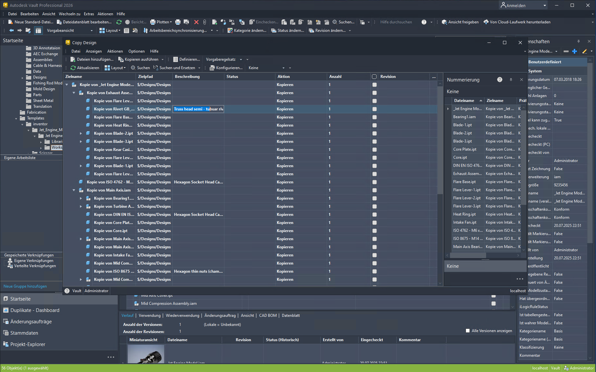
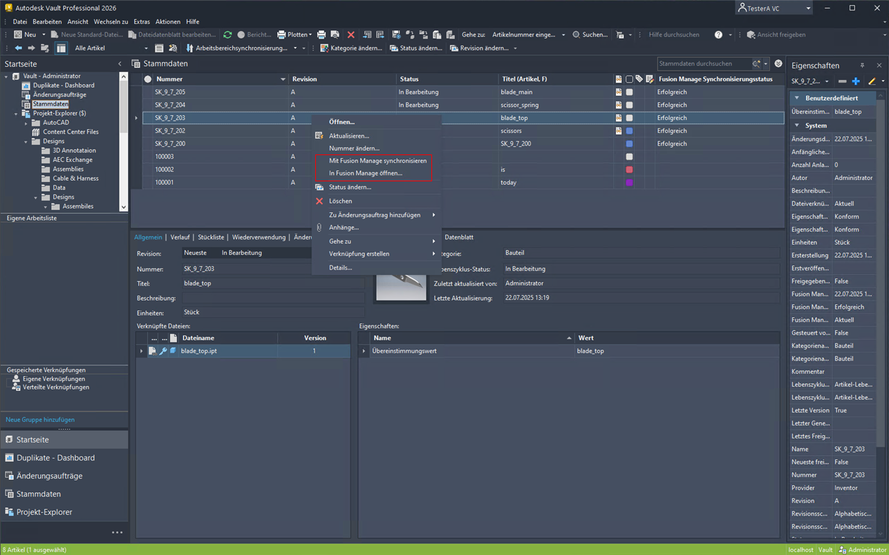
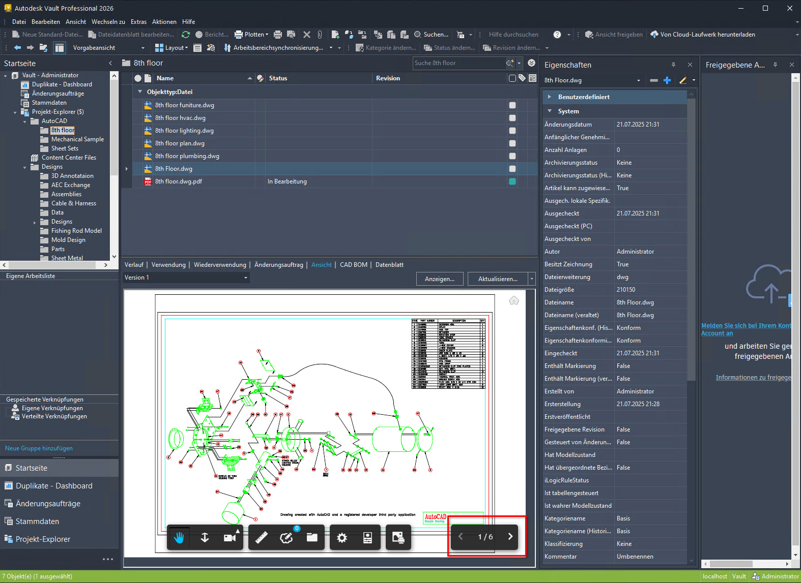
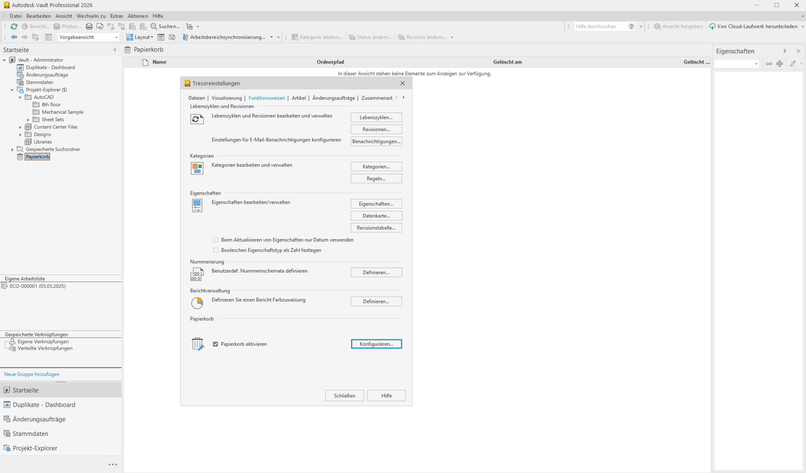
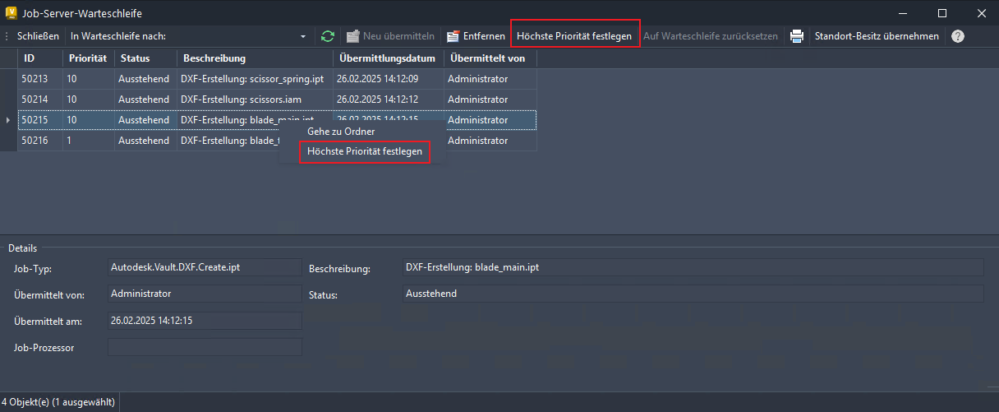
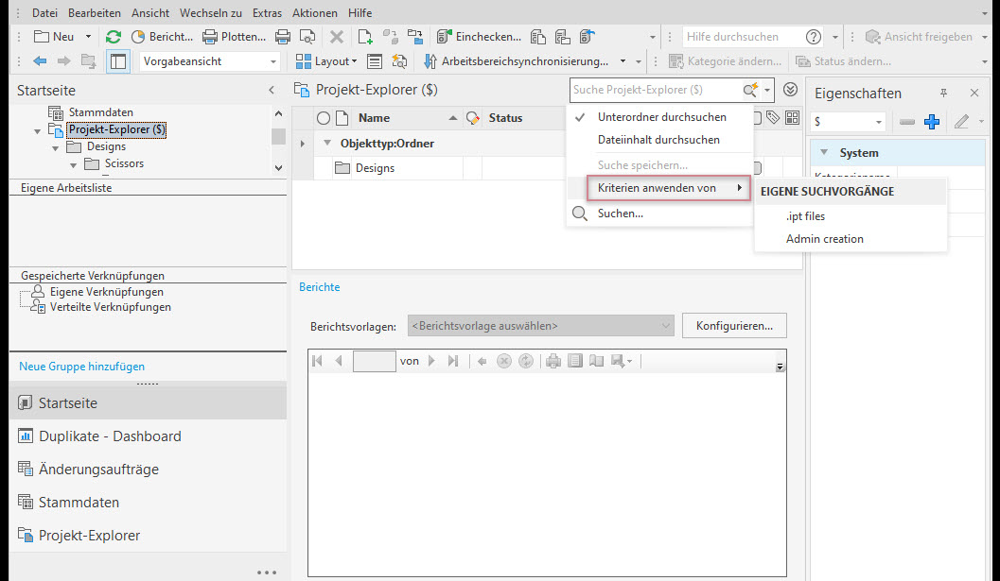

# Neue Funktionen in Vault 2026

## Highlights des 2026.1 Update

### Verbesserungen an Arbeitsabläufen

### Verbesserungen bei Verbindungen

### Verbesserungen bei Zusammenarbeit

## Highlights der Version 2026

### Verbesserte Verwaltungsfunktionen

### Papierkorb

### Verbesserungen am Job-Prozessor

### Verbesserungen bei der Archivierung

### Waren diese Informationen hilfreich?

- Email

- Facebook

- Twitter

- LinkedIn

- 2026: Aktualisierungen und Verbesserungen

- 2026.1: Updates und Verbesserungen

- Ja

- Nein

Diese Version von Vault enthält von Ihnen und der Vault-Anwender-Community angeforderte Verbesserungen, die Ihnen eine deutlich schnellere Konstruktionserstellung und Datenverwaltung ermöglichen.

Erfahren Sie mehr über die neuen Funktionen in dieser Version von Vault. Technische Details finden Sie in den Versionshinweisen .

Entdecken Sie die neuen Funktionen und Verbesserungen in dieser Version, durch die die Effizienz Ihrer Arbeitsabläufe verbessert wird.

Nahtlose und effiziente Verbindung von Vault und Fusion Manage mit dem neuen Vault Connector

Entdecken Sie die neuen Funktionen und Verbesserungen in dieser Version, durch die die Zusammenarbeit verbessert wird.

Erfahren Sie mehr über die neuen Funktionen und Verbesserungen zur Verwaltung, die in dieser Version verfügbar sind.

Als Administrator können Sie jetzt die Papierkorbfunktion aktivieren oder deaktivieren. Die Papierkorbfunktion in Vault Professional bietet eine sichere Methode zum Verwalten des Löschvorgangs bei Objekten wie Dateien und Ordnern. Diese Funktion ist vorgabemäßig aktiviert und ermöglicht es Benutzern, Objekte in den Papierkorb zu verschieben, anstatt sie dauerhaft zu löschen. Dies reduziert das Risiko eines versehentlichen Datenverlusts und verbessert die Benutzerfreundlichkeit, indem Benutzer mehr Kontrolle über die Dateiverwaltung erhalten.

Sie können Job-Ausführungen priorisieren und steuern, um Fehler besser zu verwalten, wenn Ihnen die Rolle Warteschleife reservieren zugewiesen ist.

Als Administrator können Sie jetzt die Dateispeicherarchivierung für einen Tresor aktivieren und den Verzeichnispfad für die archivierte Datei angeben. Die neue Eigenschaft Archivierungsstatus ist für Ordner und Dateien verfügbar.

## Images

