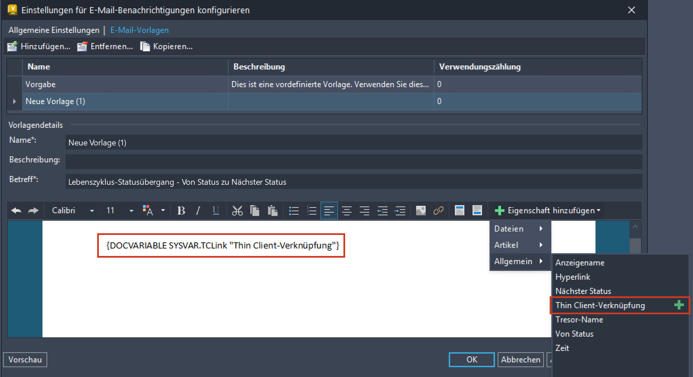

# Verbesserte Verwaltungsfunktionen (Neue Funktionen in 2026)

## Verbesserungen bei Vault-Konten - Sicherheitsupdates

## Thin-Client-URL-Eigenschaft in E-Mail-Vorlage

## Serverereignis Modus mit niedriger Priorität für die Prüfung der Eigenschaftenkonformität

## Kontaktdaten für Vault-Administratoren

### Waren diese Informationen hilfreich?

- Email

- Facebook

- Twitter

- LinkedIn

- Ja

- Nein

Erfahren Sie mehr über die neuen Funktionen und Verbesserungen zur Verwaltung, die in dieser Version verfügbar sind.

Als Administrator können Sie jetzt die Option Deaktivieren am für Benutzerkonten aktivieren. Das Konto wird automatisch zum angegebenen Datum (basierend auf dem Serverdatum) deaktiviert. Eine Vault Ideas-Übermittlung

Sie können jetzt die Thin-Client-URL-Eigenschaft in der E-Mail-Vorlage hinzufügen oder entfernen. Weitere Informationen finden Sie unter E-Mail-Benachrichtigungsvorlage anpassen .

Der Modus mit niedriger Priorität wird vorgabemäßig während der Arbeitszeiten aktiviert. Dieser Modus unterstützt jetzt die Überprüfung der Eigenschaftenkonformität. Überprüfungen der Eigenschaftenkonformität können durch Änderungen an Eigenschaftsdefinitionen während der Arbeitszeiten ausgelöst werden.

Der Administrator kann seine Kontaktinformationen im neuen Feld Wenden Sie sich an den Vault-Administrator in Vault Server eingeben. Die Kontaktinformationen des Administrators werden Benutzern angezeigt, deren Benutzerkonto deaktiviert ist, und wenn sie versuchen, sich über Vault Client beim Server anzumelden.

Weitere Informationen finden Sie unter Globale Sicherheitseinstellungen .

## Images

