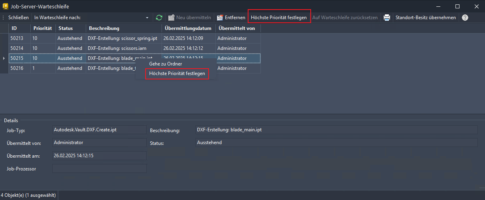

# Verbesserungen am Job-Prozessor (Neue Funktionen in 2026)

## Verschieben eines Jobs an den Anfang der Warteschlange

### Waren diese Informationen hilfreich?

- Email

- Facebook

- Twitter

- LinkedIn

- Höchste Priorität festlegen : Klicken Sie mit der rechten Maustaste auf einen bestimmten Job, um auf diese Option zuzugreifen und den Job für die sofortige Ausführung hochzustufen.

- Ja

- Nein

Sie können Job-Ausführungen priorisieren und steuern, um Fehler besser zu verwalten, wenn Ihnen die Rolle Warteschleife reservieren zugewiesen ist.

Sie können jetzt die Prioritäten der Job-Ausführung steuern und Job-Fehler effizient verwalten. Mit der Möglichkeit, kritische Jobs hochzustufen und automatische Wiederholungsläufe zu aktivieren, können Benutzer mit der Rolle Warteschleife reservieren eine reibungslosere Verarbeitung sicherstellen und Verzögerungen minimieren.

Weitere Informationen finden Sie unter Aufgaben der Job-Server-Warteschleife .

Inspiriert wurde die Funktion durch Vorschläge aus dem Vault Community Idea Board .

## Images

